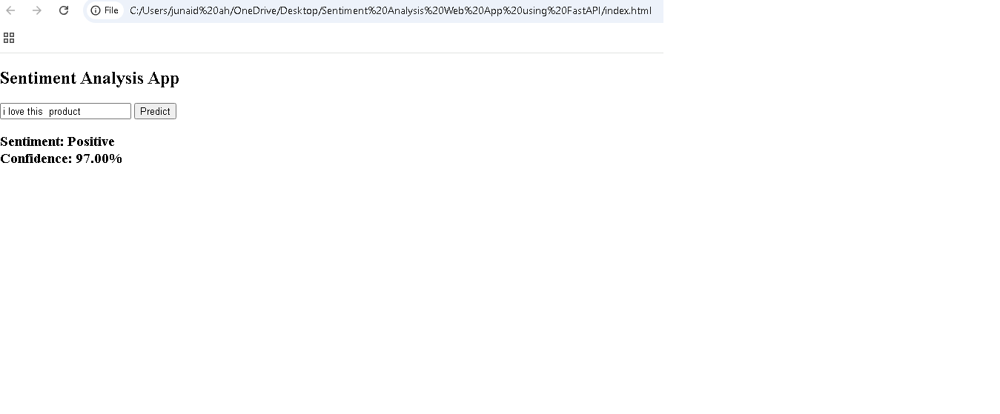

# Sentiment Analysis Web App using FastAPI

## Project Overview
This is a full-stack machine learning web application that predicts the sentiment of user input text.

## Features
- Sentiment prediction (Positive / Negative)
- Confidence score
- FastAPI backend
- Simple HTML + JavaScript frontend

## Tech Stack
- Python
- FastAPI
- Scikit-learn
- HTML, JavaScript

## Project Structure
├── app.py...... 
├── index.html..... 
├── sentiment_model.pkl..... 
├── vectorizer.pkl..... 
├── requirements.txt.... 

## How to Run

1. Install dependencies: pip install -r requirements.txt
2. Run API: uvicorn app:app --reload
3. Open index.html in browser

## Example
Input: I love this product  
Output: Positive (Confidence: 0.97)

## 📸 Screenshot

## Author
junaid war